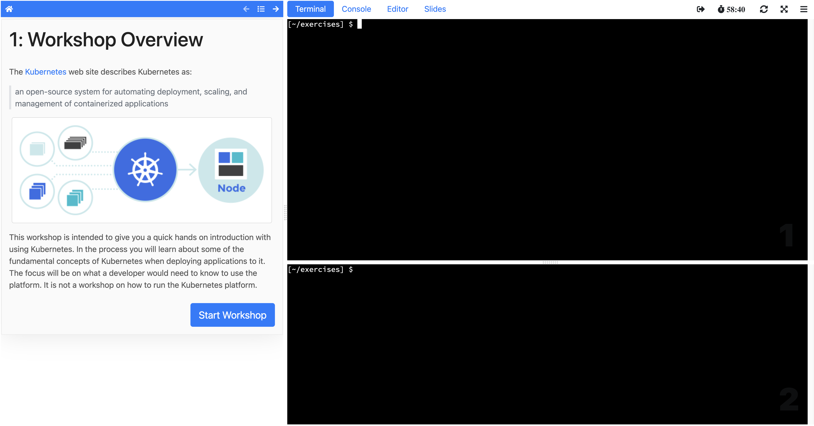

A specific hosted workshop can be selected via the Educates training portal web
interface, or a distinct custom web portal, which interacts with the Educates
training portal application via a REST API to request access to a workshop.

In either case, a workshop session for the hosted workshop is allocated to the
user and they are redirected to the dashboard for the workshop session.

The workshop dashboard typically consists of a set of instructions on the left
hand side, with one or more interactive terminals on the right hand side for
executing commands. Additional applications can be embedded as tabs on the right
hand side. This might include an IDE, slide presentation, Kubernetes web
console, other custom web applications hosted with the workshop, or separate web
sites.
